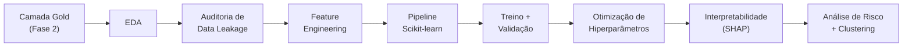

# Tech Challenge – Fase 3
## Predição e Inteligência Analítica para Alfabetização no Brasil 🇧🇷

Projeto integrador da Fase 3 da Pós-Tech. Enquanto a **Fase 2** construiu a pipeline de
engenharia de dados (Bronze → Silver → Gold) do **Indicador Criança Alfabetizada**, esta fase
utiliza a camada Gold resultante para desenvolver **modelos supervisionados de Machine
Learning** capazes de transformar dados públicos em inteligência aplicada à decisão.

---

##  Contexto do Problema

A alfabetização na infância é um dos principais indicadores de desenvolvimento educacional e
social do país. O **Compromisso Nacional Criança Alfabetizada** (Decreto nº 11.556/2023)
mobiliza União, estados, Distrito Federal e municípios para garantir que todas as crianças
estejam alfabetizadas até o fim do **2º ano do ensino fundamental**.

A partir da **Pesquisa Alfabetiza Brasil (INEP, 2023)** definiu-se o corte de **743 pontos**
na escala Saeb, a partir do qual uma criança é considerada alfabetizada. O **Indicador Criança
Alfabetizada** expressa o percentual de estudantes que atingem esse patamar, com **meta
nacional de 80% até 2030**.

Conhecer apenas os dados atuais, porém, não basta. Gestores públicos precisam **antecipar
riscos**, identificar regiões vulneráveis e compreender **quais fatores mais influenciam** o
indicador — para agir antes do resultado, não depois dele. É esse o espaço que a Ciência de
Dados ocupa aqui.

---

##  Objetivo Analítico

Desenvolver um **modelo supervisionado** capaz de prever se um aluno será considerado
**alfabetizado ou não alfabetizado**, utilizando variáveis educacionais, territoriais e
socioeconômicas provenientes da camada Gold da Fase 2.

O projeto trabalha em **duas granularidades complementares**, porque a decisão de política
pública acontece nas duas:

| Nível | Pergunta que responde | Uso |
|-------|----------------------|-----|
| **Agregado** (município/rede) | O município/rede vai atingir a meta de 80%? | Planejamento estratégico, alocação de recursos |
| **Individual** (aluno) | Este aluno será alfabetizado? | Intervenção pedagógica, alerta precoce |


---

##  Descrição da Base Utilizada

Os dados vêm da **camada Gold** construída na Fase 2, no Databricks (Unity Catalog + Delta Lake):

| Tabela | Conteúdo | Volume |
|--------|----------|--------|
| `workspace.gold.features_ml` | Features agregadas por município / rede / ano | ~24 mil registros |
| `workspace.default.microdados_alunos_gold` | Microdados de aluno enriquecidos com indicadores municipais | ~3,8 milhões de alunos |
| `workspace.gold.indicadores_municipio` | Indicadores municipais com classificações | — |
| `workspace.gold.metas_vs_resultados_uf` | Metas estaduais × resultados (2024–2030) | — |

### Origem dos dados

Microdados oficiais do **INEP** — Avaliação da Alfabetização / AEEB — integrados na Fase 2 com
as bases de **metas** (nacional, estadual e municipal) da
[Base dos Dados](https://basedosdados.org/).

### Variáveis do aluno disponíveis

A base `TS_ALUNO` do INEP contém 15 colunas. As relevantes para a modelagem:

| Variável | Descrição | Uso no modelo |
|----------|-----------|---------------|
| `IN_ALFABETIZADO` | Alvo: 0 = Não, 1 = Sim (proficiência ≥ 743) | **target** |
| `IN_PRESENCA_LP` | Indicador de presença **na prova** de LP (0/1) | feature |
| `TP_SERIE` | Série (constante: 2º ano) | descartada |
| `CO_CADERNO_LP` | Caderno de prova atribuído ao aluno | feature |
| `TP_DEPENDENCIA` | Rede (federal / estadual / municipal / privada) | feature |
| `ID_ESCOLA`, `CO_MUNICIPIO`, `SG_UF` | Identificação territorial | base das features de contexto |
| `VL_PROFICIENCIA_LP` | Nota na escala Saeb | **excluída — define o alvo** |


---

##  Etapas de Modelagem



###  Análise Exploratória (EDA)

Distribuição do alvo, balanceamento de classes, valores ausentes, cardinalidade das variáveis
categóricas e distribuição da proficiência em relação ao corte de 743 pontos.

###  Auditoria de Data Leakage

Etapa central do projeto, e a que mais alterou os resultados. Foram identificadas variáveis que
**só existem depois** do resultado que se quer prever:

| Variável removida | Por quê |
|-------------------|---------|
| `proficiencia` | É a nota da prova — define o alvo diretamente pelo corte de 743 |
| `taxa_alfabetizacao` | Calculada a partir dos próprios alunos que se quer prever |
| `media_portugues` | Altamente correlacionada com a proficiência |
| `nivel_0` … `nivel_8` | Distribuição derivada do próprio alvo |
| `preenchimento_caderno` | Correlacionado ao desempenho na prova |

**Impacto medido:** de **99,86% de acurácia** (com vazamento) para **~65%** (sem vazamento). A
queda é o resultado correto — o primeiro número não se sustentaria em produção, porque a
proficiência não existe no momento em que a predição precisaria ser feita.

###  Tratamento do Split Temporal

Investigação da sobreposição de registros entre os anos de treino (2023) e teste (2024), com
filtragem dos casos identificados como repetidos para evitar memorização entre os conjuntos.

###  Feature Engineering

Criação de variáveis de **contexto**, já que os microdados praticamente não trazem atributos do
próprio aluno:

- **Contexto escolar** — presença média da escola, desvio-padrão, número de alunos
- **Contexto município/rede** — presença média e porte da rede
- **Posição relativa** — diferença entre o aluno e a média da sua escola / do seu município
- **Transformações não-lineares** — termos quadrático e cúbico da presença
- **Discretizações** — faixas de presença e de porte de escola

###  Pipeline Scikit-learn

Todo o pré-processamento é **integrado ao modelo**, garantindo que os parâmetros de
transformação sejam ajustados apenas no conjunto de treino:

```python
Pipeline([
    ('preprocessor', ColumnTransformer([
        ('num', Pipeline([
            ('imputer', SimpleImputer(strategy='median')),
            ('scaler',  StandardScaler())
        ]), num_features),
        ('cat', Pipeline([
            ('imputer', SimpleImputer(strategy='constant', fill_value='missing')),
            ('onehot',  OneHotEncoder(handle_unknown='ignore'))
        ]), cat_features)
    ])),
    ('modelo', XGBClassifier(...))
])
```

###  Validação

- **Split temporal** — treino em 2023, teste em 2024 (simula predição de um ano futuro)
- **Cross-validation** — `StratifiedKFold` (5 folds) sobre o conjunto de treino
- **`random_state` fixo** em todas as etapas, garantindo replicabilidade

###  Otimização de Hiperparâmetros

`RandomizedSearchCV` sobre `learning_rate`, `max_depth`, `min_child_weight`, `subsample`,
`colsample_bytree`, `gamma`, `reg_alpha` e `reg_lambda`, com o objetivo de aumentar a
generalização e reduzir overfitting.

---

##  Escolha do Algoritmo

**XGBoost (Extreme Gradient Boosting)** como modelo principal.

| Critério | Justificativa |
|----------|---------------|
| **Desempenho em dados tabulares** | Estado da arte para problemas estruturados como este |
| **Escala** | `tree_method='hist'` processa milhões de registros em CPU |
| **Valores ausentes** | Trata `NaN` nativamente, sem imputação obrigatória |
| **Regularização** | `reg_alpha` (L1), `reg_lambda` (L2), `gamma` e `min_child_weight` controlam overfitting |
| **Interpretabilidade** | `feature_importances_` nativo e compatibilidade direta com SHAP |
| **Desbalanceamento** | `scale_pos_weight` permite ajuste quando necessário |

Complementarmente, **KMeans** é utilizado para agrupar municípios com padrões semelhantes
(pergunta de negócio nº 3).

---

##  Métricas de Avaliação

| Métrica | Por que está aqui |
|---------|-------------------|
| **F1-Score** | Métrica principal. Média **harmônica** entre precisão e recall — e é por ser harmônica que pune o desequilíbrio entre as duas. Um modelo que declara todo mundo alfabetizado tem recall alto e precisão baixa; a média aritmética o perdoaria, a harmônica não. Essencial num problema em que o atalho de chutar a classe majoritária está sempre disponível |
| **Precision** | Dos alunos apontados como alfabetizados, quantos realmente são — evita falso otimismo |
| **Recall** | Dos que realmente são, quantos o modelo encontrou — evita deixar aluno em risco fora do radar |
| **AUC-ROC** | Independe de limiar; mede a capacidade de **ordenar** por risco, que é o uso prático do modelo |
| **Accuracy** | Reportada **por clareza de leitura**, por ser a métrica mais intuitiva na conversa com gestores. Não é usada para selecionar modelo |
| **Matriz de Confusão** | Explicita o custo de cada tipo de erro |


---

##  Interpretação dos Resultados

Evolução documentada ao longo das correções aplicadas:

| # | Modelo | Accuracy | AUC-ROC | Precision | Recall | F1-Score |
|---|--------|----------|---------|-----------|--------|----------|
| 0 | Com data leakage (`proficiencia`) | 99,86% | ~100% | — | — | — |
| 1 | Limpo, sem vazamento de features | 64,72% | 62,09% | 59,97% | 98,21% | 74,47% |
| 2 | + Split temporal corrigido | *preencher* | *preencher* | *preencher* | *preencher* | *preencher* |
| 3 | + Feature Engineering | *preencher* | *preencher* | *preencher* | *preencher* | *preencher* |
| 4 | + Otimização de hiperparâmetros | *preencher* | *preencher* | *preencher* | *preencher* | *preencher* |


**Leitura do modelo nº 1.** Recall de 98,21% com precisão de 59,97% descreve um modelo que
classifica quase todos os alunos como alfabetizados. Ele praticamente não erra ao identificar
quem será alfabetizado, mas quase não distingue quem não será — exatamente o comportamento que
o F1 e a matriz de confusão expõem e que a acurácia isolada esconderia.

**O modelo agregado** (município/rede) alcança desempenho superior ao individual. Não por ser
mais bem construído, mas porque o alvo é diferente: ao agregar centenas de alunos, a variação
individual — imprevisível com os dados disponíveis — se cancela, e resta o efeito do território,
que o histórico consegue capturar.

---

##  Insights Encontrados

**1. O contexto territorial vale mais que o cadastro individual.** Os microdados não trazem
sexo, raça, idade, nível socioeconômico nem frequência anual do aluno. Praticamente toda a
informação preditiva disponível é **onde o aluno estuda** — o que torna as features agregadas de
escola e município o principal ativo do modelo.

**2. Há forte desigualdade entre municípios.** O clustering (KMeans, k=5) separa grupos com
taxas médias que vão de ~36% a ~94% de alfabetização, evidenciando que a meta nacional exige
políticas diferenciadas por perfil, e não uma estratégia única.

**3. Vazamento de dados produz números convincentes e inúteis.** A queda de 99,86% para ~65% foi
o resultado mais importante do projeto: mostra que métrica alta sem auditoria é um risco, não
uma conquista.

---

##  Limitações do Projeto

**Ausência de variáveis do aluno.** O `TS_ALUNO` tem 15 colunas e nenhum atributo individual
(sexo, raça, idade, NSE, frequência ao longo do ano, histórico de reprovação). Dois colegas da
mesma escola são indistinguíveis para o modelo, o que impõe um teto à predição individual
independentemente do algoritmo escolhido.

**Ruído no próprio rótulo.** O corte de 743 pontos cai na região mais densa da distribuição de
proficiência. Alunos próximos à linha podem mudar de classificação por erro de medida do teste,
o que representa incerteza irredutível no alvo.

**`IN_PRESENCA_LP` não está disponível no momento da predição.** Ela só é observada no dia da
aplicação. Um alerta emitido no meio do ano letivo não sabe quem faltará — o que limita o uso da
variável em um cenário real de antecipação.

**Features de contexto escolar exigem defasagem temporal.** Agregações por escola calculadas
sobre o **mesmo ano** do alvo incorporam o rótulo do próprio aluno e reintroduzem vazamento. O
contexto precisa vir sempre de anos anteriores ao que se está prevendo.

**Split temporal sobre duas edições.** Treino em 2023 e teste em 2024 oferece apenas um par de
anos. A edição de 2025, já disponível nos microdados, permitiria validação fora do tempo
adicional e mais robusta.

**Fontes externas não incorporadas.** O enunciado sugere enriquecimento com IBGE, Censo Escolar,
FUNDEB, Atlas do Desenvolvimento Humano e Cadastro Único. Esse enriquecimento **não foi
realizado** nesta entrega e permanece como evolução futura.

**Dependência do ambiente Databricks.** Os notebooks leem tabelas do Unity Catalog
(`workspace.gold.*`), o que exige o workspace da Fase 2 provisionado para execução integral.

---

##  Aplicação Prática para Políticas Públicas

| Aplicação | Como o modelo apoia |
|-----------|--------------------|
| **Priorização orçamentária** | Ranqueamento de municípios por probabilidade de não atingir a meta, concentrando recursos onde o risco é maior |
| **Alerta precoce** | Identificação de escolas e alunos em risco antes do fim do ano letivo, viabilizando reforço pedagógico ainda a tempo de alterar o resultado |
| **Mobilização para a avaliação** | Como a ausência conta como não alfabetizado, ações de garantia de comparecimento têm efeito direto e imediato sobre o indicador |
| **Políticas por perfil regional** | Os clusters do KMeans agrupam municípios com padrões semelhantes, permitindo estratégias por grupo em vez de política única |
| **Monitoramento de metas** | Acompanhamento da distância entre resultado projetado e meta pactuada (`gap_meta`), município a município |

**Ciclo operacional sugerido:**

```
Coleta (início do ano) → Predição (junho) → Intervenção (jul–nov) → Reavaliação (out–nov)
```

---

##  Estrutura do Repositório

```
TechChallenge_3/
├── TechChallenge_Fase3/
│   └── notebooks/
│       └── 01_XGBoost_Alfabetizacao.py   # Notebook Databricks (modelo agregado + individual)
└── README.md                             # Este documento
```

---

##  Como Executar

**Pré-requisitos**
- Workspace **Databricks** com as tabelas da Fase 2 disponíveis no Unity Catalog
- Python 3.8+

**Dependências**
```bash
pip install xgboost shap scikit-learn pandas numpy matplotlib seaborn
```

**Execução**
1. Importar `01_XGBoost_Alfabetizacao.py` no workspace do Databricks
2. Anexar a um cluster com acesso ao catálogo `workspace`
3. Executar as células em ordem (`Run All`)

---

##  Equipe

| Integrante | Contato |
|------------|---------|
| Isabelle Nicole Santana de Brito | isabelle_nicole@outlook.com |
| Filipe Noberto Justino | justinofilipe03@hotmail.com |
| Leandro Rebes Camargo | leandrorcamargo@hotmail.com |
| Felipe Vieira Sanches | fvieirasanches@gmail.com |

---

##  Vídeo Executivo

> _Link a ser adicionado (apresentação executiva de até 5 minutos)._

---
